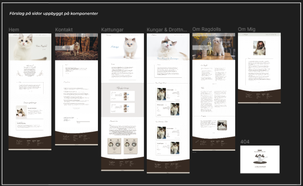
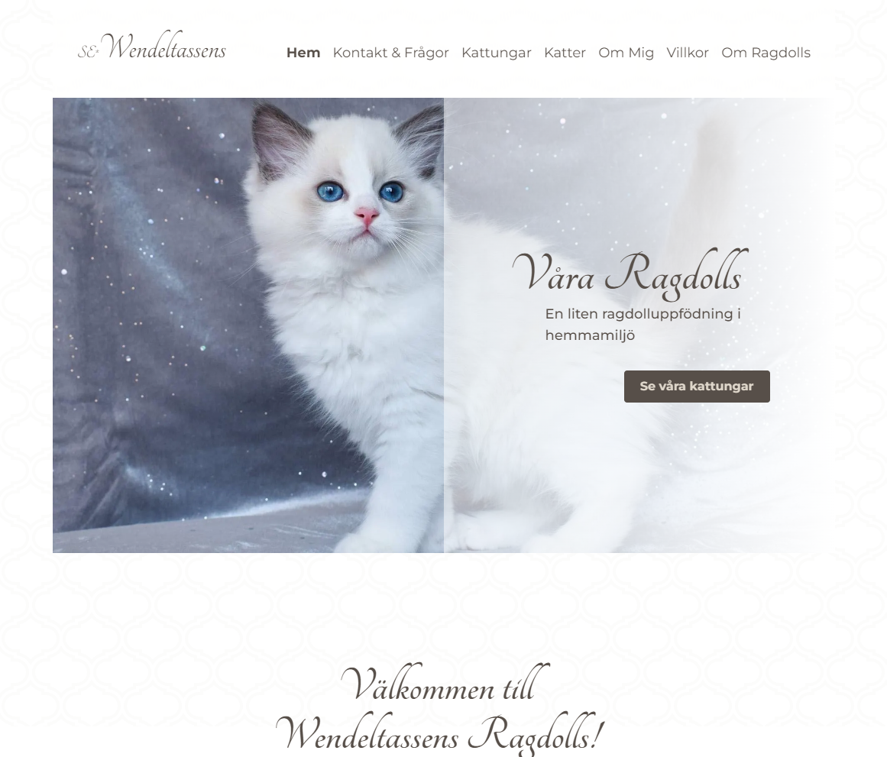

# [Wendeltassens Ragdoll hemsida](https://wendeltassens.vercel.app)

- [Wendeltassens Ragdoll hemsida](#wendeltassens-ragdoll-hemsida)
  - [Beskrivning](#beskrivning)
  - [Design](#design)
  - [Tech Stack](#tech-stack)
  - [Demo](#demo)
  - [Skapare](#skapare)
  - [Nycklar till projektet (Environment Variables)](#nycklar-till-projektet-environment-variables)
  - [För att köra projektet lokalt](#för-att-köra-projektet-lokalt)
  - [Repo](#repo)
  - [Hosting](#hosting)

---

## Beskrivning

Ragdollkatter är älskade för sina unika personligheter och tillgivna natur, och detta är en webbplats dedikerad till att främja och koppla ihop ragdolluppfödaren med potentiella köpare. Webbplatsen är till för ragdolluppfödaren att visa upp sina katter, få kontakt med intresserade köpare.

Detta projekt är byggt med hjälp av Next.js, ett populärt JavaScript-ramverk för att bygga webbapplikationer, och Sanity CMS, ett headless innehållshanteringssystem.
Sanity Studion är integrerad i sidan och nås på routen "/studio" (lösenordsskyddad).

## Design

En ren, professionell design som visar upp katterna och avelsprogrammet på ett visuellt tilltalande sätt.
Skapat i Figma.  
Färgvalen är harmoniska och baserade på Ragdoll kattens naturliga färger.



## Tech Stack

**Client:** [React](https://reactjs.org/), [NextJS 13](https://beta.nextjs.org/docs), [Tailwind CSS](https://tailwindcss.com/)

**CMS:** [Sanity](https://www.sanity.io/)

**Övrigt:** Typescript, next-sanity, react-hook-form, portabletext-react

## Demo

[Wendeltassens Ragdolls](https://wendeltassens.vercel.app)


## Skapare

- [Tomas Fridekrans](https://www.github.com/spaceflake)
- [Olivia Isberg](https://github.com/OliviaIsberg)

## Nycklar till projektet (Environment Variables)

**OBS!!!** För att köra detta projekt krävs ett par api-nycklar och tokens.
Förfrågan om dessa skickas till skaparna.

## För att köra projektet lokalt

Klona repot

```bash
  git clone https://github.com/spaceflake/wendeltassens.git wendeltassens
```

Gå till projektets folder

```bash
  cd wendeltassens
```

Installera paket

```bash
  npm install
```

Starta utvecklarläget

```bash
  npm run dev
```

## Repo

[Repo](https://github.com/spaceflake/wendeltassens)

## Hosting

Projektet är hostat på Vercel.

För att läsa mer om vercel.
[Vercel dokumentation](https://vercel.com/docs)
